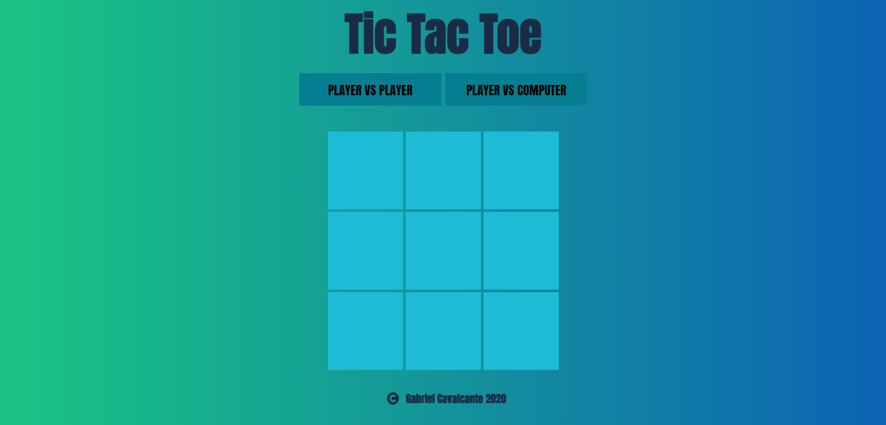
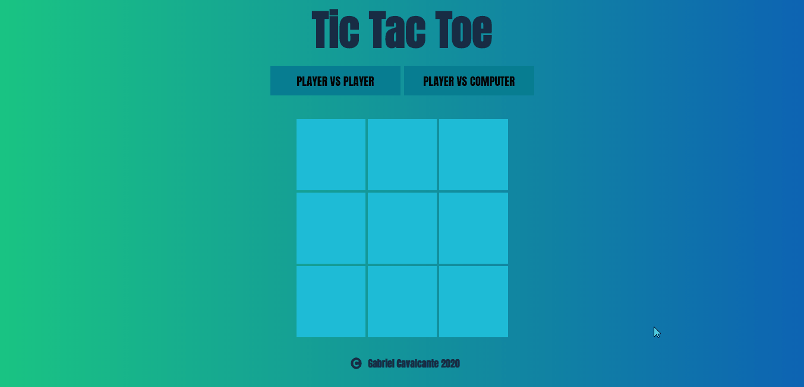

#  Tic Tac Toe



> Este é um projeto no qual você pode jogar <strong> tic tac toe </strong> no seu computador.

Este projeto é uma adaptação simples do popular jogo Tic Tac Toe, onde os jogadores jogam com círculos e cruzes (O e X), tentando
ter uma linha, uma coluna ou uma diagonal com os mesmos símbolos escolhidos. Neste projeto, você também pode jogar contra o computador com uma IA simulada.

#### Linguagens
Leia este arquivo no seu idioma preferido:
- [English](README.md)
- [Português](README.pt.md)

#### Principais tecnologias utilizadas

- React
  - Redux
- Typescript

## Sumário

- [Instalação na máquina local](#instalacao-na-maquina-local)
- [Jogar Demo](#jogar-demo)
- [Como usar](#como-usar)
- [Licença](#licenca)
- [Sobre](#sobre)

[Voltar ao topo](#tic-tac-toe)<br>
[Voltar ao sumário](#sumario)


## Instalação na máquina local

0. Primeiro, verifique se o NODEJS está instalado no seu computador.
1. Clone este repositório.
1. Abra seu terminal na pasta do projeto criado e execute ```npm install``` ou, para os usuários de ```yarn```, execute ```yarn add``` para instalar todas as dependências.
1. Após a instalação, execute ```npm start``` ou ```yarn start``` para iniciar o servidor de desenvolvimento.


[Voltar ao topo](#tic-tac-toe)<br>
[Voltar ao sumário](#sumario)

## Jogar Demo
Se você quiser testar este aplicativo, acesse este [link](https://gabrielmcavalcante.github.io/TicTacToe/)

## Como usar
Jogar tic tac toe é muito simples, e neste projeto não é diferente. Apenas siga
as etapas abaixo e você estará pronto para jogar com seus amigos.

#### Versus outro jogador local



#### Versus computador


[Voltar ao topo](#tic-tac-toe)<br>
[Voltar ao sumário](#sumario)

## Licença

MIT License

Copyright (c) 2020 GabrielMCavalcante

Permission is hereby granted, free of charge, to any person obtaining a copy
of this software and associated documentation files (the "Software"), to deal
in the Software without restriction, including without limitation the rights
to use, copy, modify, merge, publish, distribute, sublicense, and/or sell
copies of the Software, and to permit persons to whom the Software is
furnished to do so, subject to the following conditions:

The above copyright notice and this permission notice shall be included in all
copies or substantial portions of the Software.

THE SOFTWARE IS PROVIDED "AS IS", WITHOUT WARRANTY OF ANY KIND, EXPRESS OR
IMPLIED, INCLUDING BUT NOT LIMITED TO THE WARRANTIES OF MERCHANTABILITY,
FITNESS FOR A PARTICULAR PURPOSE AND NONINFRINGEMENT. IN NO EVENT SHALL THE
AUTHORS OR COPYRIGHT HOLDERS BE LIABLE FOR ANY CLAIM, DAMAGES OR OTHER
LIABILITY, WHETHER IN AN ACTION OF CONTRACT, TORT OR OTHERWISE, ARISING FROM,
OUT OF OR IN CONNECTION WITH THE SOFTWARE OR THE USE OR OTHER DEALINGS IN THE
SOFTWARE.

[Voltar ao topo](#tic-tac-toe)<br>
[Voltar ao sumário](#sumario)

## Sobre

- Github - [GabrielMCavalcante](https://github.com/GabrielMCavalcante)

- LinkedIn - [Gabriel Cavalcante](https://www.linkedin.com/in/gabriel-cavalcante-4182061a2)

[Voltar ao topo](#tic-tac-toe)<br>
[Voltar ao sumário](#sumario)
